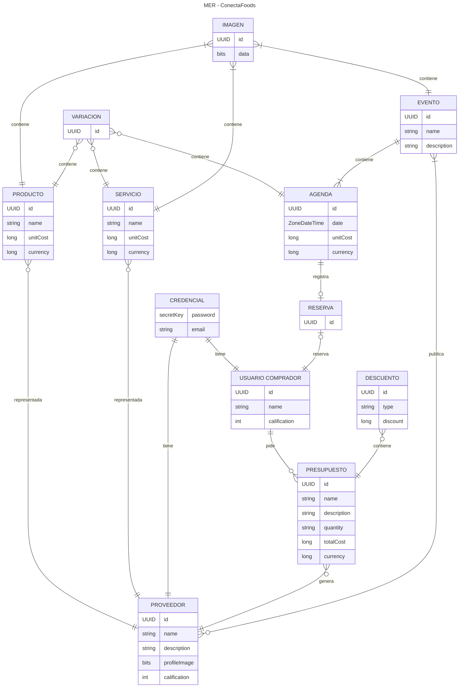

```mermaid
---
title: MER - ConectaFoods
---
erDiagram
    "IMAGEN" }|--|| "EVENTO" : contiene
    "IMAGEN" }|--|| "PRODUCTO" : contiene
    "VARIACION" }o--|| "SERVICIO" : contiene
    "IMAGEN" }|--|| "SERVICIO" : contiene
    "VARIACION" }o--|| "PRODUCTO" : contiene
    "VARIACION" }o--|| "AGENDA" : contiene
    "PRODUCTO" }o--|| "PROVEEDOR" : representada
    "SERVICIO" }o--|| "PROVEEDOR" : representada
    "CREDENCIAL" ||--|| "USUARIO COMPRADOR" : tiene
    "CREDENCIAL" ||--|| "PROVEEDOR" : tiene
    "PROVEEDOR" }o--|{ "EVENTO" : publica
    "PRESUPUESTO" }o--|| "PROVEEDOR" : genera
    "EVENTO" ||--|{ "AGENDA" : contiene
    "AGENDA" ||--o| "RESERVA" : registra
    "RESERVA" |o--|| "USUARIO COMPRADOR" : reserva
    "USUARIO COMPRADOR" ||--o{ "PRESUPUESTO" : pide
    "DESCUENTO" }o--|| "PRESUPUESTO" : contiene

    
    "IMAGEN" {
        UUID id
        bits data
    }

    "VARIACION" {
        UUID id
    }

    "DESCUENTO" {
        UUID id
        string type
        long discount
    }

    "PRODUCTO" {
        UUID id
        string name
        long unitCost
        long currency
    }

    "SERVICIO" {
        UUID id
        string name
        long unitCost
        long currency
    }

    "EVENTO" {
        UUID id
        string name
        string description
    }

    "AGENDA" {
        UUID id
        ZoneDateTime date
        long unitCost
        long currency
    }

    "RESERVA" {
        UUID id
    }

    "PROVEEDOR" {
        UUID id
        string name
        string description
        bits profileImage
        int calification
    }

    "CREDENCIAL" {
        secretKey password
        string email
    }

    "USUARIO COMPRADOR" {
        UUID id
        string name
        int calification
    }

    "PRESUPUESTO" {
        UUID id
        string name
        string description
        string quantity
        long totalCost
        long currency
    }

```