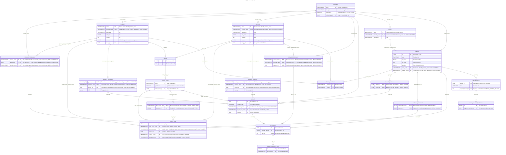

```mermaid
---
title: MER - ConectaFoods
---
erDiagram
    PROVIDER ||--o{ PRODUCT_DISCOUNT : "provider_name"
    PRODUCT_DISCOUNT ||--o{ DISCOUNT : "discount_id"    
    DISCOUNT ||--o{ ENUM_DISCOUNT_TYPE : "type_id"
    PROVIDER ||--o{ PRODUCT : "provider_name"
    PRODUCT ||--o{ PRODUCT_DISCOUNT : "product_name, provider_name"
    PRODUCT ||--o{ CART_ITEM : "product_name, provider_name"
    PRODUCT ||--o{ BUDGET_PRODUCT : "product_name, provider_name"
    BUDGET_PRODUCT ||--o{ BUDGET : "budget_id"
    BUDGET ||--o{ DISCOUNT : "discount_id"
    PRODUCT ||--o{ IMAGE : "image_id"
    SERVICE ||--o{ IMAGE : "image_id"
    IMAGE ||--o{ BUYER_USER : "profile_image_id"
    BUYER_USER ||--o{ CART_ITEM : "user_buyer_name"
    BUYER_USER ||--o{ CART : "buyer_user_name"
    CART ||--o{ CART_ITEM : "cart_item_id"
    BUYER_USER }o--||BUDGET  : "buyer_user_name"
    PROVIDER ||--o{ SERVICE : "provider_name"
    PROVIDER ||--o{ SERVICE_DISCOUNT : "provider_name"
    SERVICE ||--o{ CART_ITEM : "service_name, provider_name"
    SERVICE ||--o{ BUDGET_SERVICE : "provider_name, service_name"
    BUDGET_SERVICE ||--o{ BUDGET : "budget_id"
    AGENDA ||--o{ ENUM_CURRENCY : "provider_name"
    AGENDA ||--o{ BUDGET_AGENDA : "agenda_id"
    SERVICE ||--o{ SERVICE_DISCOUNT : "service_name, provider_name"
    SERVICE_DISCOUNT ||--o{ DISCOUNT : "discount_id"
    AGENDA ||--o{ AGENDA_DISCOUNT : "agenda_discount_id"
    AGENDA_DISCOUNT ||--o{ DISCOUNT : "discount_id"
    PROVIDER ||--o{ BUDGET : "provider_name"
    PROVIDER ||--o{ EVENT : "provider_name"
    EVENT ||--o{ AGENDA : "event_name, provider_name"
    PROVIDER ||--o{ AGENDA : "provider_name"
    AGENDA ||--o{ CART_ITEM : "agenda_id"
    RESERVATION ||--o{ ENUM_PAYMENT_METHOD : "paid with"
    AGENDA ||--o{ RESERVATION : "agenda_id"
    BUDGET_AGENDA ||--o{ BUDGET : "budget_id"
    PRODUCT ||--o{ ENUM_CURRENCY : "provider_name"
    SERVICE ||--o{ ENUM_CURRENCY : "provider_name"

    "IMAGE" {
        UUID id PK "The image Id. AG"
        bits data UK "The image data. NN"
    }

    "ENUM_DISCOUNT_TYPE" {
        SERIAL id PK "The enum index. AI"
        VARCHAR(255) discount_type UK "The discout type name"
    }

    "ENUM_PAYMENT_METHOD" {
        SERIAL id PK "The enum index. AI"
        UUID payment_method_type UK "The payment method type name"
    }

    "PROVIDER" {
        VARCHAR(255) name PK "Provider unique name"
        VARCHAR(255) description "Provider description. NN"
        SMALLINT qualification "Qualification from 1 to 5 form buyers."
        UUID profile_image_id FK "Image id from IMAGE. NN"
    }

    "DISCOUNT" {
        UUID id PK "Id of the disccount."
        BIGINT discount_amount UK "UK with type_id. NN"
        int type_id FK, UK "UK with discount_ammount. NN"
    }

    "BUYER_USER" {
        VARCHAR(255) name PK "Buyer unique name"
        SMALLINT qualification "Qualification from 1 to 5 form providers."
        UUID profile_image_id FK "Image id from IMAGE. NN"
    }

    "PRODUCT" {
        VARCHAR(255) name PK "Product name. PK with provider_name."
        VARCHAR(255) provider_name PK,FK "Provider name. PK with product_name and FK from PROVIDER."
        VARCHAR(255) description "NN"
        BIGINT unit_cost  "NN"
        INT currency  "NN"
        JSONB variation  "JSON of properties variations of a product"
        UUID image_id FK "Image id from IMAGE. NN"
    }

    "EVENT" {
        VARCHAR(255) name PK "Event name. PK with provider_name."
        VARCHAR(255) provider_name PK,FK "Provider name. PK with product_name and FK from PROVIDER."
        VARCHAR(255) description "NN"
    }

    "SERVICE" {
        VARCHAR(255) name PK "Service name. PK with provider_name."
        VARCHAR(255) provider_name PK,FK "Provider name. PK with product_name and FK from PROVIDER."
        VARCHAR(255) description "NN"
        BIGINT unit_cost "NN"
        INT currency "NN"
        JSONB variation "JSON of properties variations of a product"
        UUID image_id FK "Image id from IMAGE. NN"
    }

    "BUDGET" {
        UUID id PK "The Budget id. AG"
        TIMESTAMP creation_date "The creation date. NN" 
        VARCHAR(255) provider_name FK "Provider name. PK with product_name, FK from PROVIDER."
        VARCHAR(255) buyer_user_name FK "Buyer User name, FK from BUYER_USER"
        UUID discount_id FK "FK from DISCOUNT."
    }

    BUDGET_SERVICE {
        VARCHAR(255) service_name PK "The service name. PK with provider_name and budget_id"
        VARCHAR(255) provider_name PK "The provider name. PK with service_name and budget_id."
        UUID budget_id PK "The budget id. PK with service_name and provider_name, FK from BUDGET."
        INT quantity "The quantity. NN"
    }

    BUDGET_PRODUCT {
        VARCHAR(255) product_name PK, FK "The product name. PK with budget_id and provider_name, FK from PRODUCT"
        VARCHAR(255) provider_name PK, FK "The provider name. PK with product_name and budget_id, FK from PROVIDER"
        UUID budget_id PK "The budget id. PK with product_name and provider_name, FK from BUDGET."
        quantity INT "The quantity. NN"
    }

    PRODUCT_DISCOUNT {
        VARCHAR(255) product_name PK, FK "The product name. PK with provider_name and discount_id, FK from PRODUCT."
        UUID discount_id PK, FK "The discount id. PK with product_name and provider_name, FK from DISCOUNT."
        VARCHAR(255) provider_name PK, FK "The provider name. PK with product_name and discount_id, FK from PROVIDER."
    }

    AGENDA {
        UUID id  PK "The Agenda id. AG"
        TIMESTAMP date  "The date. NN" 
        BIGINT unit_cost  "The unit cost. NN"
        INT currency  "The currency. NN"
        JSONB variation  "The JSON variation. NN"
        VARCHAR(255) event_name FK "Event name. PK with provider_name and FK from EVENT."
        VARCHAR(255) provider_name FK "Provider name. PK with event_name and FK from PROVIDER."
    }

    SERVICE_DISCOUNT {
        VARCHAR(255) service_name PK, FK "The service name. PK with provider_name and discount_id, FK from SERVICE."
        VARCHAR(255) provider_name PK, FK "The provider name. PK with service_name and discount_id, FK from PROVIDER."
        UUID discount_id PK, FK "The discount id. PK with service_name and provider_name, FK from DISCOUNT."
    }

    CART_ITEM {
        SERIAL id PK "Primary key"
        VARCHAR(255) user_buyer_name FK "User buyer name. FK from BUYER_USER."
        VARCHAR(255) provider_name FK "Provider name. PK with user_buyer_name, service_name and product_name, FK from PROVIDER."
        UUID agenda_id FK "Agenda id. FK from AGENDA."
        VARCHAR(255) service_name FK "Service name. PK with provider_name and FK from SERVICE."
        VARCHAR(255) product_name FK "Product name. PK with provider_name and FK from PRODUCT."
    }

    BUDGET_AGENDA {
        UUID agenda_id PK, FK "Agenda id. PK with budget_id, FK from AGENDA."
        UUID budget_id PK, FK "Budget id. PK with agenda_id, FK from BUDGET."
    }

    AGENDA_DISCOUNT {
        UUID agenda_discount_id PK, FK "Agenda id. PK with discount_id, FK from AGENDA."
        UUID discount_id PK, FK "Discount id. PK with agenda_discount_id, FK from DISCOUNT."
    }

    RESERVATION {
        UUID agenda_id PK "Agenda id. PK and FK from AGENDA."
        TIMESTAMP date "The date. NN"
        INT payment_method_id FK "Payment method id. FK from ENUM_PAYMENT_METHOD."
    }

    CART {
        VARCHAR(255) buyer_user_name PK, FK "Buyer user name. PK with cart_item_id, FK from BUYER_USER."
        SERIAL cart_item_id PK "Cart item id. PK with buyer_user_name, FK from CART_ITEM."
    }

    ENUM_CURRENCY {
        VARCHAR(255) currency PK "Currency name."
        VARCHAR(255) symbol UK "Currency symbol."
    }

```